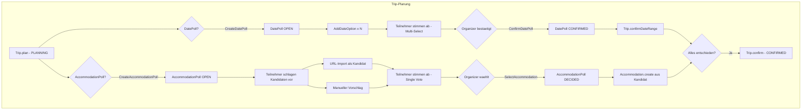

# EventStorming: Iteration 14 -- Collaborative Trip Planning (Date Poll + Accommodation Poll)

**Datum**: 2026-03-29
**Bounded Context**: Trips (Core Domain)
**Epic**: E-TRIPS-08 -- Collaborative Trip Decision Making
**User Stories**: US-TRIPS-080 bis US-TRIPS-084
**Methode**: Design-Level EventStorming (Alberto Brandolini)

---

## 1. Ueberblick

Iteration 14 fuehrt kollaborative Abstimmungsmechanismen in die Reiseplanung ein. Zwei
Abstimmungstypen bedienen den Planungsprozess:

1. **DatePoll** -- Mehrfachauswahl (Doodle-artig): "Welche Zeitraeume passen euch?"
2. **AccommodationPoll** -- Einfachauswahl mit Re-Vote: "Welche Unterkunft bevorzugt ihr?"

Beide folgen demselben Grundmuster (Optionen sammeln, abstimmen, Organisator entscheidet),
unterscheiden sich aber in Abstimmungsmodus, Verbindung zum Trip-Aggregat und Kandidaten-Herkunft.

### Warum zwei separate Aggregate statt einem generischen Poll?

Die Unterschiede ueberwiegen die Gemeinsamkeiten:

| Aspekt | DatePoll | AccommodationPoll |
|--------|----------|-------------------|
| Abstimmungsmodus | Multi-Select (Doodle) | Single Active Vote |
| Optionen-Typ | DateRange (Value Object) | AccommodationCandidate (Entity mit URL, Preis, Zimmer) |
| Ergebnis-Aktion | Trip.dateRange wird gesetzt | Accommodation-Aggregat wird erstellt/verknuepft |
| Kandidaten-Quelle | Nur Organizer definiert | Alle Teilnehmer koennen vorschlagen |
| Kandidaten-Lebenszyklus | Einfach (hinzufuegen/entfernen) | Komplex (aktiv/archiviert/ausgewaehlt) |

Ein generisches `Poll<T>`-Aggregat wuerde die unterschiedlichen Invarianten verwischen und die
Domain-Sprache verduennen. Stattdessen: **zwei eigenstaendige Aggregate** mit aehnlicher
Struktur, aber fachlich korrektem Verhalten.

---

## 2. Akteure

| Akteur | Beschreibung | Stimmrecht |
|--------|-------------|------------|
| **Organizer** | Trip-Organisator (Keycloak-Rolle `organizer`) | Ja + Entscheidungsrecht |
| **Participant** | Account-haltender Teilnehmer (Member) | Ja |
| **Dependent** | Mitreisende(r) ohne eigenen Account | Nein |

**Stimmrecht-Regel**: Nur Account-haltende Teilnehmer (Members) koennen abstimmen.
Dependents haben kein Stimmrecht. Pro Account eine Stimme (bzw. Multi-Select bei DatePoll).

---

## 3. Domain Events (chronologisch)

### 3.1 DatePoll-Flow

```
DatePollCreated
  -> DateOptionAdded*
    -> DateOptionRemoved*
      -> DateVoteCast
        -> DateVoteChanged
          -> DatePollConfirmed
```

### 3.2 AccommodationPoll-Flow

```
AccommodationPollCreated
  -> AccommodationCandidateProposed
    -> AccommodationCandidateArchived
      -> AccommodationVoteCast
        -> AccommodationVoteMoved
          -> AccommodationSelected
```

### 3.3 Trip-Lifecycle-Integration

```
                    Trip.plan() [PLANNING]
                         |
              +----------+----------+
              |                     |
        DatePollCreated    AccommodationPollCreated
              |                     |
         [Abstimmung]          [Abstimmung]
              |                     |
       DatePollConfirmed    AccommodationSelected
              |                     |
       Trip.dateRange        Accommodation.create()
         aktualisiert        oder verknuepft
              |                     |
              +----------+----------+
                         |
                   Trip.confirm() [CONFIRMED]
```

---

## 4. Command-Event-Mapping

### 4.1 DatePoll

| Command | Akteur | Aggregat | Event(s) | Vorbedingungen |
|---------|--------|----------|----------|----------------|
| CreateDatePoll | Organizer | **DatePoll** | DatePollCreated | Trip in PLANNING, kein aktiver DatePoll fuer diesen Trip |
| AddDateOption | Organizer | DatePoll | DateOptionAdded | Poll ist OPEN, >= 0 bestehende Optionen |
| RemoveDateOption | Organizer | DatePoll | DateOptionRemoved | Poll ist OPEN, Option hat keine Stimmen ODER explizite Bestaetigung |
| CastDateVote | Participant | DatePoll | DateVoteCast | Poll ist OPEN, Voter ist Account-Inhaber + Trip-Teilnehmer |
| ChangeDateVote | Participant | DatePoll | DateVoteChanged | Poll ist OPEN, vorherige Stimme existiert |
| ConfirmDatePoll | Organizer | DatePoll | DatePollConfirmed | Poll ist OPEN, mindestens eine Option vorhanden |
| CancelDatePoll | Organizer | DatePoll | DatePollCancelled | Poll ist OPEN |

### 4.2 AccommodationPoll

| Command | Akteur | Aggregat | Event(s) | Vorbedingungen |
|---------|--------|----------|----------|----------------|
| CreateAccommodationPoll | Organizer | **AccommodationPoll** | AccommodationPollCreated | Trip in PLANNING, kein aktiver AccommodationPoll fuer diesen Trip |
| ProposeCandidate | Participant | AccommodationPoll | AccommodationCandidateProposed | Poll ist OPEN, Participant ist Account-Inhaber |
| ArchiveCandidate | Organizer | AccommodationPoll | AccommodationCandidateArchived | Kandidat ist ACTIVE, Poll ist OPEN |
| CastAccommodationVote | Participant | AccommodationPoll | AccommodationVoteCast | Poll ist OPEN, Voter hat noch nicht gestimmt |
| MoveAccommodationVote | Participant | AccommodationPoll | AccommodationVoteMoved | Poll ist OPEN, Voter hat bereits gestimmt |
| SelectAccommodation | Organizer | AccommodationPoll | AccommodationSelected | Poll ist OPEN, Kandidat ist ACTIVE |
| CancelAccommodationPoll | Organizer | AccommodationPoll | AccommodationPollCancelled | Poll ist OPEN |

---

## 5. Aggregate-Design (Design-Level)

### 5.1 DatePoll

```
DatePoll (Aggregate Root)
├── DatePollId          : Value Object (UUID)
├── TenantId            : Value Object (aus common)
├── TripId              : Value Object (Referenz auf Trip)
├── PollStatus          : Enum (OPEN, CONFIRMED, CANCELLED)
├── List<DateOption>    : Entity
│   ├── DateOptionId    : Value Object (UUID)
│   └── DateRange       : Value Object (startDate, endDate -- wiederverwendet aus trip/)
├── List<DateVote>      : Entity
│   ├── DateVoteId      : Value Object (UUID)
│   ├── voterId         : UUID (Account-ID)
│   └── Set<DateOptionId> : ausgewaehlte Optionen (Multi-Select)
└── confirmedOptionId   : DateOptionId? (null bis ConfirmDatePoll)
```

**Invarianten**:
- Maximal ein OPEN DatePoll pro Trip
- Mindestens 2 DateOptions noetig fuer Erstellung
- Ein Voter kann mehrere Optionen waehlen (Doodle-Muster)
- Nur Account-Inhaber duerfen abstimmen (kein Dependent)
- Nur Organizer darf Optionen hinzufuegen/entfernen und bestaetigen
- ConfirmDatePoll waehlt genau eine Option als Gewinner
- Nach CONFIRMED sind keine weiteren Stimmen moeglich

### 5.2 AccommodationPoll

```
AccommodationPoll (Aggregate Root)
├── AccommodationPollId     : Value Object (UUID)
├── TenantId                : Value Object (aus common)
├── TripId                  : Value Object (Referenz auf Trip)
├── PollStatus              : Enum (OPEN, DECIDED, CANCELLED)
├── List<AccommodationCandidate> : Entity
│   ├── CandidateId         : Value Object (UUID)
│   ├── name                : String
│   ├── url                 : String? (Booking-Link)
│   ├── address             : String?
│   ├── estimatedPrice      : BigDecimal?
│   ├── notes               : String? (Freitext des Vorschlagenden)
│   ├── proposedBy          : UUID (Account-ID)
│   └── CandidateStatus     : Enum (ACTIVE, ARCHIVED, SELECTED)
├── List<AccommodationVote> : Entity
│   ├── VoteId              : Value Object (UUID)
│   ├── voterId             : UUID (Account-ID)
│   └── candidateId         : CandidateId
└── selectedCandidateId     : CandidateId? (null bis SelectAccommodation)
```

**Invarianten**:
- Maximal ein OPEN AccommodationPoll pro Trip
- Jeder Account-Inhaber hat genau eine aktive Stimme (Single Vote)
- MoveVote entfernt alte Stimme und setzt neue (atomar im Aggregat)
- Nur auf ACTIVE Kandidaten kann abgestimmt werden
- ArchiveCandidate entfernt Stimmen auf diesen Kandidaten (Voter wird informiert)
- SelectAccommodation ist Organizer-Entscheidung, unabhaengig von Stimmenzahl
- Archivierte Kandidaten bleiben fuer Fallback sichtbar

### 5.3 Wiederverwendete Value Objects

| Value Object | Herkunft | Verwendung |
|-------------|----------|------------|
| `TenantId` | travelmate-common | Tenant-Scoping beider Poll-Aggregate |
| `TripId` | trips/domain/trip/ | Referenz auf Trip |
| `DateRange` | trips/domain/trip/ | DateOption-Zeitraeume |

---

## 6. Policies / Reaktionen (lilac Stickies)

### Policy P1: DatePollConfirmed -> Trip.dateRange aktualisieren

```
WENN DatePollConfirmed empfangen
DANN lade Trip mit tripId
     setze Trip.dateRange auf confirmedOption.dateRange
     speichere Trip
```

**Implementierung**: Innerhalb des Trips-SCS als `@TransactionalEventListener` oder
als Application-Service-Orchestrierung im selben Use Case (ConfirmDatePollService).

**Offene Frage** (Hot Spot HS-1): Soll ConfirmDatePoll direkt Trip.dateRange setzen
(im selben Application Service) oder ueber ein internes Domain Event entkoppelt werden?

**Empfehlung**: Direkter Application-Service-Aufruf, da beides im selben Bounded Context
und in derselben Transaktion liegt. Kein Cross-SCS-Event noetig.

### Policy P2: AccommodationSelected -> Accommodation-Aggregat erstellen/verknuepfen

```
WENN AccommodationSelected empfangen
DANN erstelle Accommodation-Aggregat aus Kandidaten-Daten
     ODER verknuepfe mit bestehendem Accommodation (wenn via URL-Import erstellt)
```

**Implementierung**: Application Service (SelectAccommodationService) erstellt
Accommodation.create() mit den Kandidaten-Daten. Falls bereits eine Accommodation
fuer den Trip existiert (z.B. durch URL-Import), wird diese ersetzt oder aktualisiert.

### Policy P3: TripCancelled -> offene Polls abbrechen

```
WENN Trip.cancel() ausgefuehrt
DANN setze alle OPEN Polls fuer diesen Trip auf CANCELLED
```

**Implementierung**: TripService.cancelTrip() ruft DatePollRepository und
AccommodationPollRepository auf, um offene Polls zu canceln.

### Policy P4: AccommodationCandidateArchived -> Stimmen bereinigen

```
WENN AccommodationCandidateArchived
DANN entferne alle Stimmen auf diesen Kandidaten
     (betroffene Voter verlieren ihre Stimme und koennen neu waehlen)
```

**Implementierung**: Innerhalb des AccommodationPoll-Aggregats in archiveCandidate().

---

## 7. Read Models (gruen)

### RM-1: DatePoll-Uebersicht

| Feld | Beschreibung |
|------|-------------|
| Optionen | Alle DateRange-Optionen mit Start/End |
| Stimmen pro Option | Anzahl Votes + Liste der Voter-Namen |
| Eigene Auswahl | Welche Optionen hat der aktuelle User gewaehlt? |
| Status | OPEN / CONFIRMED / CANCELLED |
| Gewinner | Bestaetiger DateRange (wenn CONFIRMED) |

**UI-Pattern**: Doodle-artige Matrix (Zeilen = Teilnehmer, Spalten = Optionen, Zellen = Haekchen).
Aggregierte Summe pro Spalte am unteren Rand.

### RM-2: AccommodationPoll-Uebersicht (Shortlist)

| Feld | Beschreibung |
|------|-------------|
| Kandidaten (ACTIVE) | Name, URL, Adresse, Preis, Vorgeschlagen von, Stimmenzahl |
| Kandidaten (ARCHIVED) | Wie ACTIVE, aber ausgegraut |
| Eigene Stimme | Auf welchen Kandidaten hat der User gestimmt? |
| Status | OPEN / DECIDED / CANCELLED |
| Gewinner | Ausgewaehlter Kandidat (wenn DECIDED) |

**UI-Pattern**: Karten-Layout mit Vote-Button pro Kandidat. Aktive Stimme visuell
hervorgehoben. Stimmenzahl als Badge.

### RM-3: Trip-Planning-Dashboard

Erweiterte Trip-Detailansicht mit Tabs oder Sektionen:
- Reisezeitraum (mit DatePoll-Status oder festem Datum)
- Unterkunft (mit AccommodationPoll-Status oder finale Accommodation)
- Teilnehmer
- Essensplan, Einkaufsliste (bestehend)

---

## 8. Hot Spots (rot)

### HS-1: Trip.dateRange-Aktualisierung bei DatePollConfirmed

**Problem**: Trip hat aktuell ein finales `dateRange` im Konstruktor. Wenn DatePoll den
Reisezeitraum erst nachtraeglich setzt, braucht Trip entweder:
- (a) ein optionales dateRange (null bis DatePoll confirmed) + neue Methode `setDateRange()`
- (b) ein vorlaeufiges dateRange bei Trip.plan(), das spaeter ueberschrieben wird

**Empfehlung**: Option (a) -- Trip.dateRange wird Optional. Bei Trip.plan() wird ein
vorlaeufiger/vorgeschlagener Zeitraum oder null gesetzt. DatePollConfirmed setzt den
endgueltigen Zeitraum via Trip.confirmDateRange(DateRange). Das erfordert eine
Breaking Change am Trip-Aggregat.

**Alternative**: Trip wird immer mit einem Zeitraum erstellt (Status quo). DatePoll
ist ein optionales Planungstool, das den bestehenden Zeitraum ueberschreibt. Einfacher,
aber semantisch unscharf ("wozu DatePoll, wenn schon ein Datum gesetzt ist?").

**Pragmatische Loesung**: Trip behaelt dateRange als Pflichtfeld. Der Organizer setzt
einen initialen "Vorschlag", den DatePollConfirmed ueberschreibt. Kein Breaking Change.
StayPeriods muessen ggf. zurueckgesetzt werden wenn sich der Zeitraum aendert.

**Severity**: HOCH -- beeinflusst Trip-Aggregat-Design und StayPeriod-Validierung.

### HS-2: StayPeriod-Invalidierung bei Zeitraum-Aenderung

**Problem**: Wenn DatePollConfirmed den Trip.dateRange aendert, koennten bestehende
StayPeriods ausserhalb des neuen Zeitraums liegen.

**Empfehlung**: Bei Trip.confirmDateRange() alle StayPeriods zuruecksetzen (auf null)
und Teilnehmer informieren, dass sie ihre Aufenthaltsdauer neu eingeben muessen.

**Severity**: MITTEL -- loesbar, aber UX-relevant.

### HS-3: Parallele Polls

**Problem**: Duerfen DatePoll und AccommodationPoll gleichzeitig laufen?

**Empfehlung**: Ja. In der Praxis ueberlappen sich Termin- und Unterkunftssuche.
Keine kuenstliche Sequenzierung erzwingen. UI zeigt beide Polls nebeneinander
im Trip-Planning-Bereich.

**Severity**: NIEDRIG -- kein technisches Problem, nur UX-Entscheidung.

### HS-4: Accommodation URL-Import und AccommodationCandidate

**Problem**: Die bestehende Accommodation-URL-Import-Funktion (Iteration 10) erstellt
ein vollwertiges Accommodation-Aggregat. AccommodationPoll sammelt Kandidaten als
leichtgewichtige Vorschlaege. Wie verhaelt sich URL-Import im Kontext einer Abstimmung?

**Empfehlung**: URL-Import erstellt einen AccommodationCandidate (nicht direkt eine
Accommodation). Der Import-Pipeline-Output (Name, Adresse, URL, Preis, Zimmer) wird
als Kandidaten-Daten im Poll verwendet. Erst nach SelectAccommodation wird ein
vollwertiges Accommodation-Aggregat erstellt.

Das erfordert eine Anpassung des AccommodationImportService: statt direkt
`Accommodation.create()` wird `AccommodationPoll.proposeFromImport()` aufgerufen
(wenn ein Poll offen ist) oder `Accommodation.create()` (wenn kein Poll).

**Severity**: MITTEL -- Auswirkung auf bestehende Import-Pipeline.

### HS-5: Voter-Identitaetspruefung (Account vs. Dependent)

**Problem**: Wie prueft das Poll-Aggregat, ob ein Voter ein Account-Inhaber ist
und kein Dependent?

**Empfehlung**: Die TravelParty-Projektion enthaelt Members und Dependents.
Der Application Service (CastVoteService) prueft ueber TravelPartyRepository,
ob der Voter ein Member ist, bevor das Command ans Aggregat weitergegeben wird.
Das Aggregat selbst speichert nur UUIDs und verlaesst sich auf die Vorpruefung.

**Severity**: NIEDRIG -- geloest durch Application-Service-Validierung.

### HS-6: Stimmen-Transparenz vs. Beeinflussung

**Problem**: Sollen Stimmen in Echtzeit sichtbar sein (Transparenz) oder erst
nach Abgabe der eigenen Stimme (Vermeidung von Beeinflussung)?

**Empfehlung**: Echtzeit-Transparenz (wie Doodle). Familienurlaub ist kein
Geheim-Wahlverfahren. Transparenz foerdert Diskussion und schnellere Einigung.

**Severity**: NIEDRIG -- UX-Entscheidung, kein technisches Risiko.

### HS-7: Trip-Lifecycle-Kopplung

**Problem**: In welchen Trip-Status sind Polls erlaubt?

**Empfehlung**: Polls sind nur in PLANNING erlaubt. Bei Trip.confirm() muessen
alle offenen Polls entweder CONFIRMED/DECIDED oder CANCELLED sein. Alternativ:
Trip.confirm() schliesst offene Polls automatisch (mit Warnung).

**Severity**: MITTEL -- beeinflusst Trip-Statusuebergaenge.

---

## 9. Aggregat-Abgrenzung und Consistency Boundaries

```
+------------------+     +-------------------+     +------------------+
|      Trip        |     |     DatePoll      |     | AccommodationPoll|
|  (Aggregate Root)|     |  (Aggregate Root) |     |  (Aggregate Root)|
|                  |     |                   |     |                  |
| - tripId --------|---->| - tripId          |     | - tripId --------|
| - tenantId       |     | - tenantId        |     | - tenantId       |
| - dateRange      |     | - options[]       |     | - candidates[]   |
| - participants[] |     | - votes[]         |     | - votes[]        |
| - status         |     | - pollStatus      |     | - pollStatus     |
+------------------+     | - confirmedOption |     | - selectedCandidate
                         +-------------------+     +------------------+
                                 |                          |
                                 v                          v
                         Trip.confirmDateRange()    Accommodation.create()
```

**Consistency Boundary**: Jedes Aggregat hat seine eigene Transaktionsgrenze.
Die Verbindung zwischen Poll-Ergebnis und Trip/Accommodation erfolgt ueber
Application Services (eventual consistency innerhalb desselben BC, nicht cross-SCS).

**Repository-Interfaces** (Ports im domain-Package):

```java
// domain/datepoll/DatePollRepository.java
public interface DatePollRepository {
    DatePoll save(DatePoll datePoll);
    Optional<DatePoll> findById(DatePollId id);
    Optional<DatePoll> findOpenByTripId(TenantId tenantId, TripId tripId);
}

// domain/accommodationpoll/AccommodationPollRepository.java
public interface AccommodationPollRepository {
    AccommodationPoll save(AccommodationPoll poll);
    Optional<AccommodationPoll> findById(AccommodationPollId id);
    Optional<AccommodationPoll> findOpenByTripId(TenantId tenantId, TripId tripId);
}
```

---

## 10. Neue Domain Events (Event-Vertraege)

Alle Events sind BC-intern (Trips). **Keine neuen Cross-SCS-Events** noetig.
Events werden als Records in `trips/domain/datepoll/` bzw.
`trips/domain/accommodationpoll/` definiert (nicht in travelmate-common).

### DatePoll Events

```java
record DatePollCreated(UUID tenantId, UUID tripId, UUID datePollId, LocalDate occurredOn) {}
record DatePollConfirmed(UUID tenantId, UUID tripId, UUID datePollId,
                         LocalDate startDate, LocalDate endDate, LocalDate occurredOn) {}
record DatePollCancelled(UUID tenantId, UUID tripId, UUID datePollId, LocalDate occurredOn) {}
```

### AccommodationPoll Events

```java
record AccommodationPollCreated(UUID tenantId, UUID tripId, UUID pollId, LocalDate occurredOn) {}
record AccommodationSelected(UUID tenantId, UUID tripId, UUID pollId,
                             UUID candidateId, String name, LocalDate occurredOn) {}
record AccommodationPollCancelled(UUID tenantId, UUID tripId, UUID pollId, LocalDate occurredOn) {}
```

**Hinweis**: Vote-Events (DateVoteCast, AccommodationVoteCast etc.) sind Aggregat-intern
und werden nicht publiziert. Sie dienen nur der internen Zustandsaenderung.

---

## 11. Prozess-Diagramm



---

## 12. Package-Struktur

```
de.evia.travelmate.trips/
├── domain/
│   ├── trip/              (bestehendes Aggregat -- bekommt confirmDateRange())
│   ├── accommodation/     (bestehendes Aggregat -- unveraendert)
│   ├── datepoll/          (NEU)
│   │   ├── DatePoll.java
│   │   ├── DatePollId.java
│   │   ├── DateOption.java
│   │   ├── DateOptionId.java
│   │   ├── DateVote.java
│   │   ├── DateVoteId.java
│   │   ├── PollStatus.java
│   │   └── DatePollRepository.java
│   └── accommodationpoll/ (NEU)
│       ├── AccommodationPoll.java
│       ├── AccommodationPollId.java
│       ├── AccommodationCandidate.java
│       ├── CandidateId.java
│       ├── CandidateStatus.java
│       ├── AccommodationVote.java
│       ├── AccommodationVoteId.java
│       └── AccommodationPollRepository.java
├── application/
│   ├── command/
│   │   ├── CreateDatePollCommand.java
│   │   ├── AddDateOptionCommand.java
│   │   ├── CastDateVoteCommand.java
│   │   ├── ConfirmDatePollCommand.java
│   │   ├── CreateAccommodationPollCommand.java
│   │   ├── ProposeCandidateCommand.java
│   │   ├── CastAccommodationVoteCommand.java
│   │   └── SelectAccommodationCommand.java
│   ├── DatePollService.java
│   └── AccommodationPollService.java
├── adapters/
│   ├── web/
│   │   ├── DatePollController.java
│   │   └── AccommodationPollController.java
│   └── persistence/
│       ├── DatePollJpaEntity.java
│       ├── DatePollJpaRepository.java
│       ├── DatePollRepositoryImpl.java
│       ├── AccommodationPollJpaEntity.java
│       ├── AccommodationPollJpaRepository.java
│       └── AccommodationPollRepositoryImpl.java
```

---

## 13. Flyway-Migrationen (geschaetzt)

```sql
-- V13__date_poll.sql
CREATE TABLE date_poll (
    id            UUID PRIMARY KEY,
    tenant_id     UUID NOT NULL,
    trip_id       UUID NOT NULL,
    status        VARCHAR(20) NOT NULL DEFAULT 'OPEN',
    confirmed_option_id UUID,
    UNIQUE (trip_id, status) -- nur ein OPEN Poll pro Trip via partial index
);

CREATE TABLE date_option (
    id            UUID PRIMARY KEY,
    date_poll_id  UUID NOT NULL REFERENCES date_poll(id) ON DELETE CASCADE,
    start_date    DATE NOT NULL,
    end_date      DATE NOT NULL
);

CREATE TABLE date_vote (
    id            UUID PRIMARY KEY,
    date_poll_id  UUID NOT NULL REFERENCES date_poll(id) ON DELETE CASCADE,
    voter_id      UUID NOT NULL,
    UNIQUE (date_poll_id, voter_id) -- ein Vote-Satz pro Voter
);

CREATE TABLE date_vote_selection (
    date_vote_id    UUID NOT NULL REFERENCES date_vote(id) ON DELETE CASCADE,
    date_option_id  UUID NOT NULL REFERENCES date_option(id) ON DELETE CASCADE,
    PRIMARY KEY (date_vote_id, date_option_id)
);

-- V14__accommodation_poll.sql
CREATE TABLE accommodation_poll (
    id            UUID PRIMARY KEY,
    tenant_id     UUID NOT NULL,
    trip_id       UUID NOT NULL,
    status        VARCHAR(20) NOT NULL DEFAULT 'OPEN',
    selected_candidate_id UUID
);

CREATE TABLE accommodation_candidate (
    id                    UUID PRIMARY KEY,
    accommodation_poll_id UUID NOT NULL REFERENCES accommodation_poll(id) ON DELETE CASCADE,
    name                  VARCHAR(200) NOT NULL,
    url                   VARCHAR(1000),
    address               VARCHAR(500),
    estimated_price       NUMERIC(10,2),
    notes                 VARCHAR(2000),
    proposed_by           UUID NOT NULL,
    status                VARCHAR(20) NOT NULL DEFAULT 'ACTIVE'
);

CREATE TABLE accommodation_vote (
    id                    UUID PRIMARY KEY,
    accommodation_poll_id UUID NOT NULL REFERENCES accommodation_poll(id) ON DELETE CASCADE,
    voter_id              UUID NOT NULL,
    candidate_id          UUID NOT NULL REFERENCES accommodation_candidate(id),
    UNIQUE (accommodation_poll_id, voter_id) -- eine aktive Stimme pro Voter
);
```

---

## 14. Story-Mapping auf Aggregate-Operationen

| Story | Commands | Aggregate |
|-------|----------|-----------|
| US-TRIPS-080 | CreateDatePoll, AddDateOption, RemoveDateOption | DatePoll |
| US-TRIPS-081 | CastDateVote, ChangeDateVote | DatePoll |
| US-TRIPS-082 | ConfirmDatePoll (+ Trip.confirmDateRange) | DatePoll + Trip |
| US-TRIPS-083 | CreateAccommodationPoll, ProposeCandidate, ArchiveCandidate | AccommodationPoll |
| US-TRIPS-084 | CastAccommodationVote, MoveAccommodationVote, SelectAccommodation | AccommodationPoll |

---

## 15. Empfehlungen fuer Implementierungsreihenfolge

```
S14-A: DatePoll Aggregate + Create + AddOption + RemoveOption   (US-080)
S14-B: DatePoll Voting (Cast + Change + Read Model)             (US-081)
S14-C: DatePoll Confirm + Trip.confirmDateRange()               (US-082)
S14-D: AccommodationPoll Aggregate + Propose + Archive          (US-083)
S14-E: AccommodationPoll Voting + Select + Accommodation-Link   (US-084)
S14-F: UI-Integration (Planning-Tab mit beiden Polls)           (uebergreifend)
```

**Abhaengigkeiten**: S14-A -> S14-B -> S14-C (sequenziell).
S14-D und S14-A koennen parallel starten. S14-E haengt von S14-D ab.
S14-F ist uebergreifend und kann inkrementell mitlaufen.

---

## 16. ADR-Kandidaten

| ADR | Thema | Kernentscheidung |
|-----|-------|------------------|
| ADR-0019 | Separate Poll-Aggregate vs. generisches Poll | Zwei eigenstaendige Aggregate statt generischem Poll -- fachliche Unterschiede ueberwiegen |
| ADR-0020 | Trip.dateRange: Optional vs. Pflichtfeld | Trip behaelt dateRange als Pflichtfeld, DatePoll ueberschreibt bei Confirmation |

---

## 17. Zusammenfassung der Architektur-Entscheidungen

1. **Zwei separate Aggregate** (DatePoll, AccommodationPoll) statt eines generischen Poll-Aggregats
2. **BC-interne Events** -- keine neuen Cross-SCS-Event-Vertraege in travelmate-common
3. **Polls sind nur im PLANNING-Status erlaubt** -- Trip.confirm() erfordert geschlossene Polls
4. **Parallele Polls moeglich** -- keine kuenstliche Sequenzierung
5. **Stimmrecht per Account** -- Dependents sind ausgeschlossen, geprueft im Application Service
6. **URL-Import wird Poll-aware** -- bei offenem AccommodationPoll wird ein Kandidat erstellt statt direkt eine Accommodation
7. **Trip.dateRange bleibt Pflichtfeld** -- DatePoll ueberschreibt den initialen Vorschlag
